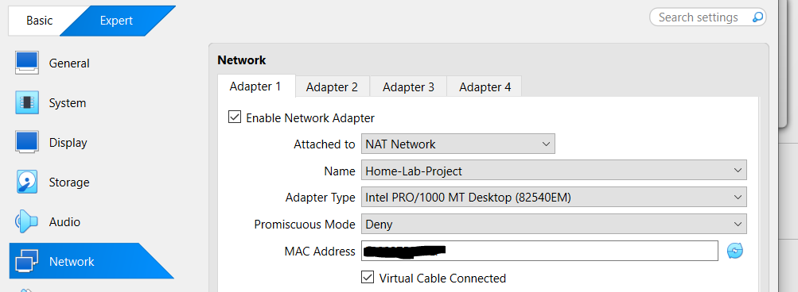
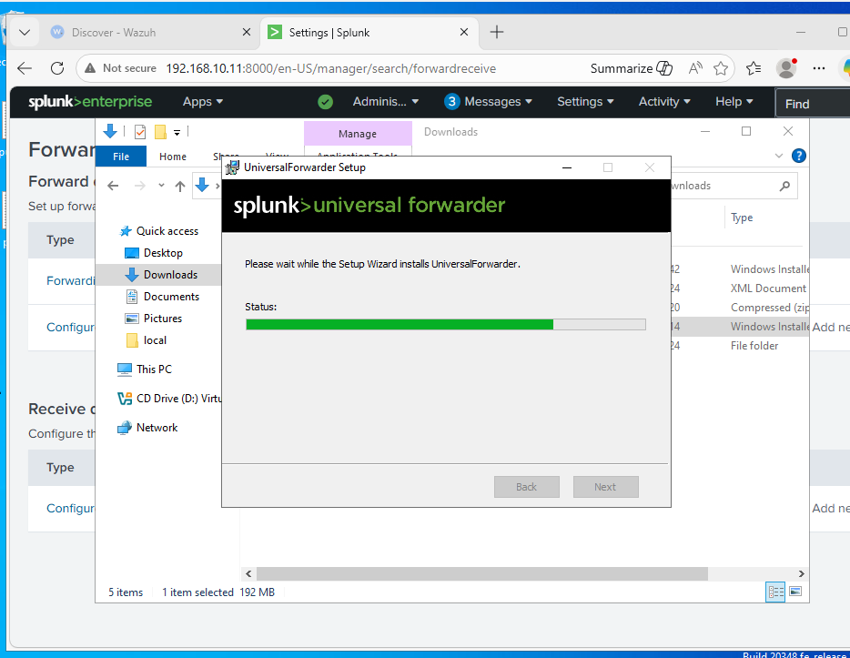
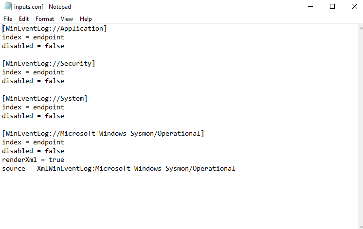
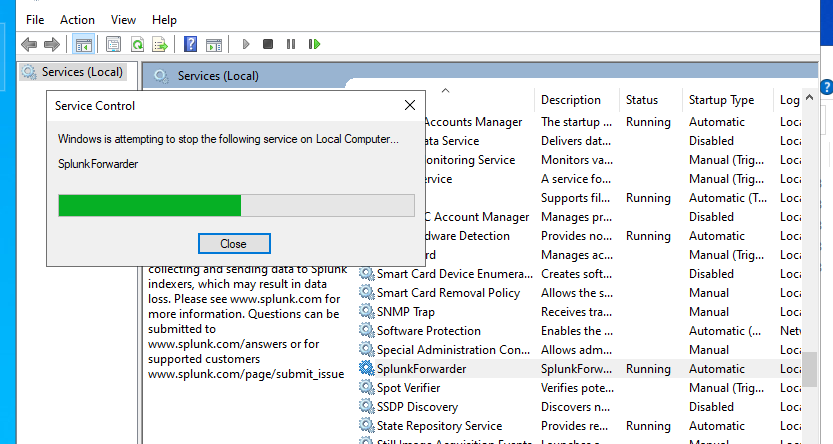
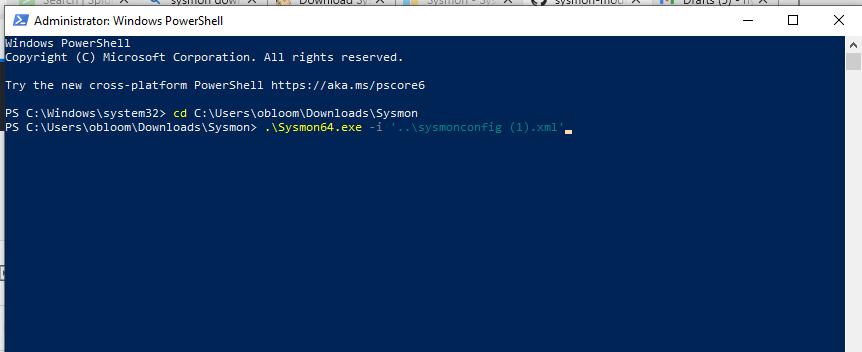

# SOC HOME-LAB : ATTACK AND DEFENSE

## INTRODUCTION
Cybersecurity home lab with 6 VMs featuring Sysmon-based logging, Splunk SIEM integration, Wazuh, and OPNsense network monitoring for attack detection and analysis. This project covers:

- Installing all six virtual machines (VMs).
- Installing and configuring Sysmon for log collection.
- Setting up Splunk.
- Setting up OPNsense.
- Setting up Wazuh.
- Configuring the VMs for proper Networking.

The objective of this lab is to simulate a realistic cybersecurity environment where attacks are performed and monitored using industry-standard SOC tools. This setup will improve practical skills in threat detection, log investigation, and incident response.

## GRAPHICAL REPRESENTATION OF THE SOC-LAB

 

## Minimum Requirements
- **RAM**: 16GB RAM — run 4-5 VMs at a time Recommended
- **Virtualization Software**: VMware or VirtualBox
- **Storage**: 500GB
- **CPU**: 6 cores minimum

## List of VMs and their purposes
| # | OS                  | RAM | Storage | Role                  |
|---|---------------------|-----|---------|-----------------------|
| 1 | Windows Server 2022 | 3GB | 40GB    | DC / Active Directory |
| 2 | Windows 10/11       | 3GB | 40GB    | Domain Client / Target|
| 3 | Ubuntu + Splunk     | 4GB | 40GB    | SIEM / Investigation  |
| 4 | Kali Linux          | 2GB | 20GB    | Attacker              |
| 5 | OPNsense            | 1GB | 10GB    | Firewall / IDS        |
| 6 | Wazuh server        | 6GB | 40GB    | EDR / XDR / SIEM      |
Total of 190GB

## PART A: INSTALLING VIRTUAL MACHINES
First, download any Virtual Machine (Oracle VirtualBox, VMware Workstation, Microsoft Hyper-V, etc.).

1. Download Win10 /11.
   - Mount the image on the VM and install Windows 10.

2. Download and install Kali for virtual machines.
   - Mount the image on the VM and install Kali.

3. Download the ISO file of Windows Server 2022. (You will have to create an account. The server is free for 180 days)
   - Mount the image on the VM and install WinServer.

4. Download Ubuntu Server (For Splunk)
   - Mount the image on the VM, choose a preferred language, and install.
   - Take note of Splunk's IP.
   - Install VirtualBox guest additions.
   - Reboot the machine.

5. Download Wazuh VM.
   - Mount the image on your VM and install.
   - Always do ```sudo -i``` to enter root mode.
   - Then ```sudo ip a```. Take note of Wazuh's IP.

6. Download the DVD version and install OPNsense.
   - Create a new VM and install OPNsense.
  
All Set !
  
 
  

## PART B: CONFIGURATION
1. Configuring the Network.

To enable communication between all virtual machines, they must be connected to the same network. This is configured on VirtualBox by assigning each VM to a shared network adapter, allowing them to interact as if they were part of the same physical environment.
   - Go to settings > Network.
   - Create a NAT. (eg mine is HOME-LAB-PROJECT).
   - Ensure to connect Every VM to this network.
 

3. Configuring Splunk Server on Windows
   - On both Windows Machines, visit the Splunk website (must create an account) and download Splunk universal forwarder.
   - Install the universal forwarder and add the Splunk IP on the receiving event.
   
   - On both the Windows server and the target machine, access the folder where the forwarder is installed (usually Program Files), go to > etc >system > local. 
   - Create "input.conf" and configure as below, so that all events are pushed to the Splunk machine using a specific index (eg, endpoint).

   - Restart Splunk forwarder service.
   
   - On Google, add your Splunk server IP, log in, > settings > create index called "endpoint" and enable it by adding the receiving port of 9997.
   - Machines are now connected to Splunk.
  
   

4. Configuring Sysmon on Windows Server and the target machine.
   - Download Sysmon on the Microsoft website
   - Use Olaf Hartong's config on GitHub.
   - Download Sysmonconfig.xml
   - Extract all
   - Open Powershell with administrative rights and install Sysmon64.exe.

      

5. Configuring Wazuh on both Windows machines
   - Open Wazuh IP on both Windows; it will direct you to an unsafe link, which is normal
   - Click "Add agent" and follow the instructions to add Windows 10 and Windows Server.

6. Configuring OPNsense firewall
   - Run firewall on VM
-	After installing (user: root /password:opnsense)
-	Change default password
-	Open a browser on Windows, type the LAN IP of your VM to access OPNsense


## Upcoming Projects in This Home Lab:
-	Active Directory
-	Atomic RedTeam
-	Phishing/Ransmoware/bruteforce attacks
-	Wireshark
-	Incidence Response playbook


