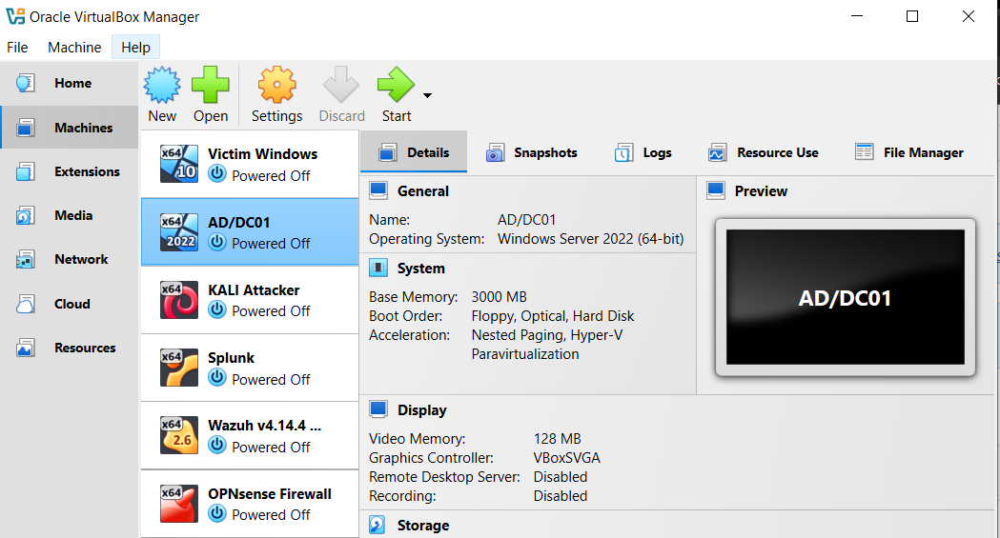
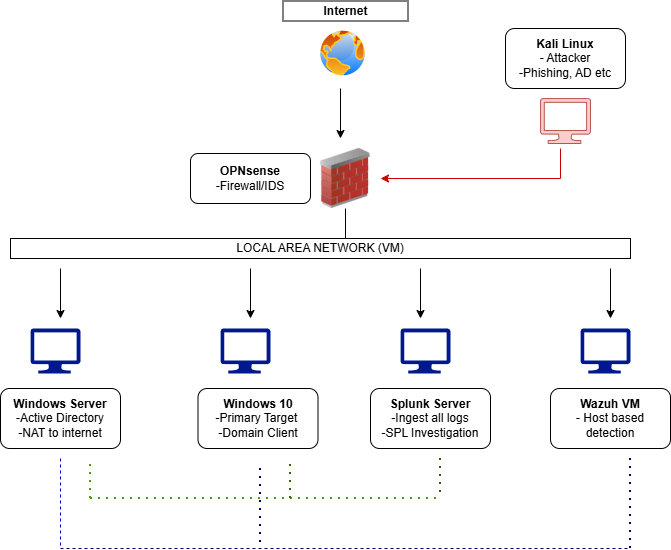

# SOC HOME-LAB : ATTACK AND DEFENSE

## INTRODUCTION
Cybersecurity home lab with 6 VMs featuring Sysmon-based logging, Splunk SIEM integration, Wazuh, and OPNsense network monitoring for attack detection and analysis. This project covers:

- Installing all six virtual machines (VMs).
- Installing and configuring Sysmon for log collection.
- Setting up Splunk.
- Setting up OPNsense.
- Setting up Wazuh.
- Configuring the VMs for proper Networking.

The objective of this lab is to simulate a realistic cybersecurity environment where attacks are performed and monitored using industry-standard SOC tools. This setup will improve practical skills in threat detection, log investigation, and incident response.

## Minimum Requirements
- **RAM**: 16GB RAM — run 4-5 VMs at a time Recommended
- **Virtualization Software**: VMware or VirtualBox
- **Storage**: 500GB
- **CPU**: 6 cores minimum

## List of VMs and their purposes
| # | OS                  | RAM | Storage | Role                  |
|---|---------------------|-----|---------|-----------------------|
| 1 | Windows Server 2022 | 3GB | 40GB    | DC / Active Directory |
| 2 | Windows 10/11       | 3GB | 40GB    | Domain Client / Target|
| 3 | Ubuntu + Splunk     | 4GB | 40GB    | SIEM / Investigation  |
| 4 | Kali Linux          | 2GB | 20GB    | Attacker              |
| 5 | OPNsense            | 1GB | 10GB    | Firewall / IDS        |
| 6 | Wazuh server        | 6GB | 40GB    | EDR / XDR / SIEM      |
Total of 190GB

## PART A: INSTALLING VIRTUAL MACHINES
First and foremost, Download any Virtual Machine (Oracle virtualbox, VMware workstation, Microsoft Hyper-V etc).

1. Download Win10 /11.
   - Mount image on VM and install Windows 10.

2. Download and install Kali for virtual machines.
   - Mount image on VM and install Kali.

3. Download the ISO file of Windows Server 2022. (You will have to create an account. The server is free for a total number of 180 days)
   - Mount image on VM and install WinServer.

4. Download Ubuntu Server (For Splunk)
   - Mount image on VM, Choose preferred language and install.
   - Take note of Splunk's IP.
   - Install virtual box guest addition.
   - Reboot machine.

5. Download Wazuh VM.
   - Mount the image on your VM and install.
   - Always do ```sudo -i``` to enter root mode.
   - Then ```sudo a```. Take note of Wazuh's IP.

6. Download the DVD version and install OPNsense.
   - Create a new VM and install OPNsense.
  
All Set !
  
 
  

## PART B: CONFIGURATION
1. Configuring the Network.

To enable communication between all virtual machines, they must be connected to the same network. This is configured on VirtualBox by assigning each VM to a shared network adapter, allowing them to interact as if they were part of the same physical environment.
   - Go to settings > Network.
   - Create a NAT. (eg mine is HOME-LAB-PROJECT).
   - Ensure to connect Every VM to this network.

3. Configuring Splunk Server on Windows
   - On both Windows Machines, visit Splunk website and download Splunk universal forwarder.
   - Install the universal forwarder and add the Splunk IP on the receiving event.
   - On the machine, access folder where the forwarder is installed, go to > etc >system > local. You will find  
   - Modify the "input.conf" so that all events are pushed to the Splunk machine using a specific index (eg. endpoint).
   - Restart Splunk forwarder service.
   - Google, add Splunk server IP, log in, > settings > create index called "endpoint" and enable it by adding the receiving port of 9997.
   - Machines are now connected to splunk.

4. Configuring Sysmon on Windows Server and Target machine.
   - Sysmon on Microsoft
   - Use Olaf Hartong's config on GitHub.
   - Download Sysmonconfig.xml
   - Extract all
   - Open Powershell with administrative rights and install Sysmon64.exe.

5. Configuring Wazuh on both Windows machines
   - Open wazuh IP on both windows
   - Click add agent and follow the instruction to add win10 and win server

6. Configuring OPNsense firewall
   - Run firewall on VM
-	After installing (user:root /password:opnsense)
-	Change default password
-	Open browser on windows type the LAN IP of your VM to access OPNsense


## GRAPHICAL REPRESANTATION OF THE SOC-LAB

 

## Upcoming Projects in This Home Lab:
-	Active Directory
-	Phishing/Ransmoware/bruteforce attacks
-	Wireshark
-	Incidence Response playbook


